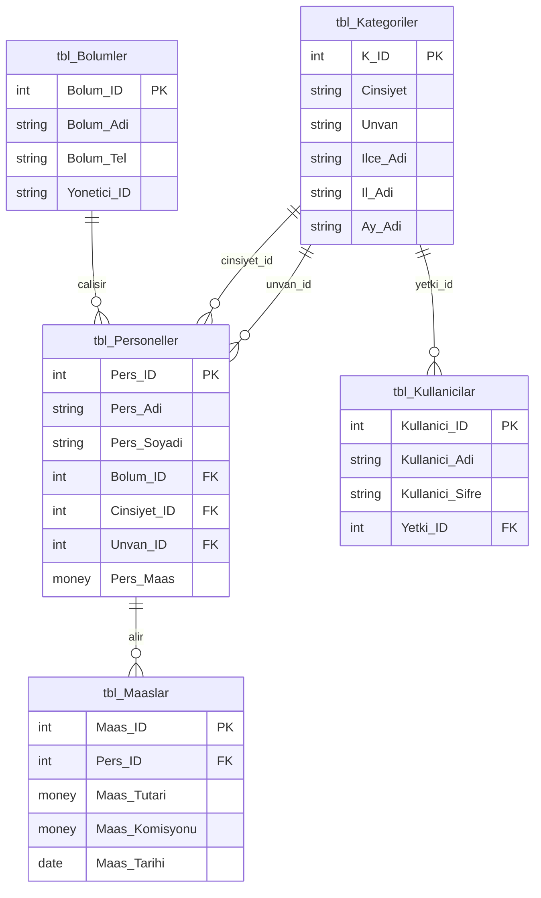

# Veritabanı Şeması (ERD)

## İlişkiler

| Tablo | İlişki | Açıklama |
|---|---|---|
| `tbl_Personeller` → `tbl_Bolumler` | many-to-one | Her personel bir bölüme bağlıdır |
| `tbl_Personeller` → `tbl_Kategoriler` (Cinsiyet_ID) | many-to-one | Cinsiyet bilgisi lookup tablosundan gelir |
| `tbl_Personeller` → `tbl_Kategoriler` (Unvan_ID) | many-to-one | Unvan bilgisi aynı lookup tablosundan gelir |
| `tbl_Maaslar` → `tbl_Personeller` | many-to-one | Her maaş kaydı bir personele aittir |
| `tbl_Kullanicilar` → `tbl_Kategoriler` (Yetki_ID) | many-to-one | Kullanıcı yetkisi lookup tablosundan gelir |

`tbl_Kategoriler`, üç farklı amaç için (cinsiyet, unvan, yetki türü)
aynı tabloya farklı foreign key'lerle referans verilen ortak bir
lookup tablosudur.

